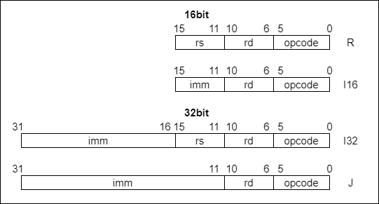

# KTC32

Hobby CPU implemented in SystemVerilog

## Features

- 32bit processor
- 32 registers
- RISC
- implemented in SystemVerilog

This CPU was based on the book "デイビット・マネー・ハリス、サラ・L・ハリス (2009) 『ディジタル電子回路とコンピュータアーキテクチャ 第 2 版』(天野英晴・鈴木貢・中條拓伯・永松礼夫訳) 翔泳社"(Digital Design and Computer Architecture Second Edition)

## Instruction Set

KTC32 has two formats of instruction.



| Instruction | Format | Opcode | Description                      | Assembly         |
| ----------- | ------ | ------ | -------------------------------- | ---------------- |
| MOV         | R      | 000000 | x[rs1/rd] = x[rs2]               | mov rs1/rd,rs2   |
| ADD         | R      | 100000 | x[rd] = x[rs1] + x[rs2]          | add rs1/rd, rs2  |
| SUB         | R      | 110000 | x[rd] = x[rs1] - x[rs2]          | sub rs1/rd, rs2  |
| AND         | R      | 010000 | x[rd] = x[rs1] & x[rs2]          | and rs1/rd, rs2  |
| OR          | R      | 011000 | x[rd] = x[rs1] \| x[rs2]         | or rs1/rd, rs2   |
| SLT         | R      | 001000 | x[rd] = (x[rs1] < x[rs2])? 1 : 0 | slt rs1/rd, rs2  |
| LW          | I      | 000011 | x[rd] = M[x[rs] + imm]           | lw rd, rs, imm   |
| ADDI        | I      | 100011 | x[rd] = x[rs] + imm              | addi rd, rs, imm |
| LUI         | I      | 110111 | x[rd] = imm << 16                | lui rd, imm      |
| SW          | I      | 000111 | M[x[rs] + imm] = x[rd]           | sw rd, rs, imm   |
| JMP         | I      | 000001 | PC = PC + imm                    | jmp imm          |
| JEQ         | I      | 100001 | if(x[rd] == x[rs]) PC = PC + imm | jeq rd, rs, imm  |

## Running Test Benches

```bash
make
```
